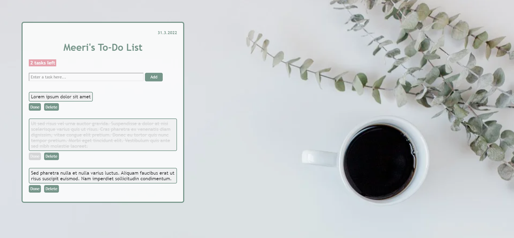

# To-Do List

*This is also my very first JavaScript project I made during my studies at Laurea UAS* :blush:

## Project Description
Project 1 for *Dynamic Web Applications with JavaScript* course (Laurea UAS 5 ects). The aim was to develop a small-scale to-do application that runs in a browser.

#### Requirements
- Application uses DOM scripting and forms
- User input is stored in the browser, e.g. local storage
- JavaScript and CSS kept in external files
- Only "native" JavaScript, no external libraries (JQuery etc.)
- Code is formatted and commented

## Features
 :abc: User is able to customize header with a username  
 :heavy_plus_sign: User can add tasks (empty or too short inputs create error messages)  
 :heavy_check_mark: User can mark tasks as done  
 :x: User can delete tasks  
 :floppy_disk: Username and undone tasks are stored in local storage  
 :loudspeaker: App shows number of tasks left to do  
 :calendar: App shows current date  

## How to Run
This application is published in Netlify: https://serene-taffy-4108cb.netlify.app/

## Technologies
- JavaScript
- HTML
- CSS

## Reflection
I really enjoyed working on (and finishing :sweat_smile:) this project! Before enrolling in the JavaScript course I didn't have any prior experience with JS and now I feel comfortable with the very basics. I'm really proud of the fact that I was able to foresee many possible scenarios and prepare for them (e.g. what happens if the user doesn't enter a username / tries to add an empty task / adds a long task / decides to click the same Done-button multiple times etc.). Learned the hard way the difference between var and let variables...:clock8: Tried my best to write pretty code with descriptive variable and function names. Tinkering with the CSS was also a lot of fun and felt like a nice reward after all the hard work with the JS code. :candy: 
